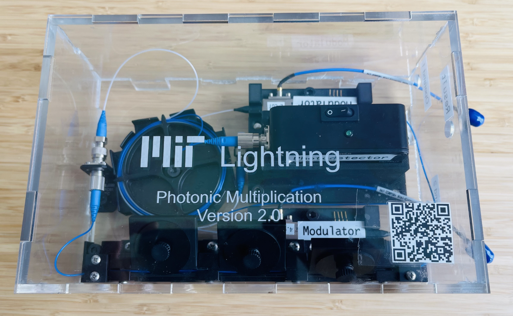

# Building your own Lightning Developer Kit


The Lightning developer kit contains the minimum-viable photonic devices to perform a single multiplication operation in the photonic domain. The current version of Lightning developer kit takes in two input signals (in analog voltages, represented by $A$ and $B$), and returns an output signal  (in analog voltages, represented by $R$). For each operation, $R=A*B$ is performed in photonic domain inside the Lightning developer kit. For more details, please refer to the Appendix of our [paper](https://doi.org/10.1145/3603269.3604821).

<p align="center">
 
</p>

## Shopping list

To build your own Lightning developer kit as shown in the figure, you need to purchase the following devices:
- Modulator: [Thorlabs 10 GHz Intensity Modulator](https://www.thorlabs.com/thorproduct.cfm?partnumber=LN81S-FC)
- Photodetector: [Thorlabs DC - 9.5 GHz InGaAs Detector](https://www.thorlabs.com/thorproduct.cfm?partnumber=PDA8GS)
- Fiber polarization controller: [Thorlabs 3 Ø27 mm Paddles](https://www.thorlabs.com/thorproduct.cfm?partnumber=FPC031)
- Acrylic sheets: [Clear Static-Dissipative Cast Acrylic, Scratch and UV Resistant, 12" x 24" x 3/16"](https://www.mcmaster.com/sheets/clear-static-dissipative-scratch-and-uv-resistant-cast-acrylic/)
- Fiber storage reels:[Thorlabs Storage Reel for Patch Cables with Ø900 µm Jackets](https://www.thorlabs.com/thorproduct.cfm?partnumber=FSR1)
- Fiber mating sleeves: [Thorlabs Single L-Bracket Mating Sleeve](https://www.thorlabs.com/thorproduct.cfm?partnumber=ADAFCPMB1), [Thorlabs Dual L-Bracket Mating Sleeve](https://www.thorlabs.com/thorproduct.cfm?partnumber=ADAFCPMB3)

## Fabrications
The Lightning developer kit's case is made by transparent acrylic sheets cutted by laser cutting machines. You can find the laser cutting source files in ```laser_cutting/```.

To secure the position of photonic devices inside the Lightning developer kit, we designed customized device support and fabricated them using 3D printers. You can find the 3D printing source files in ```3D_printing/```.


## Supporting equipment
To facilitates the Lightning developer kit and use it to test out your ideas on photonic computing, you will need the following equipment to build a minimum-viable testbed. Note that these equipment are not mandatory and can be replaced if you find other alternatives. 

- Laser source: [Santec TSL-770 Tunable Laser](https://inst.santec.com/products/tunablelaser/tsl-770)
- DAC/ADC (on RFSoC FPGA): [AMD Xilinx ZCU111](https://www.xilinx.com/products/boards-and-kits/zcu111.html)
- RF amplifier: [Texas Instruments LMH5401 Evaluation Module
](https://www.ti.com/tool/LMH5401EVM)

